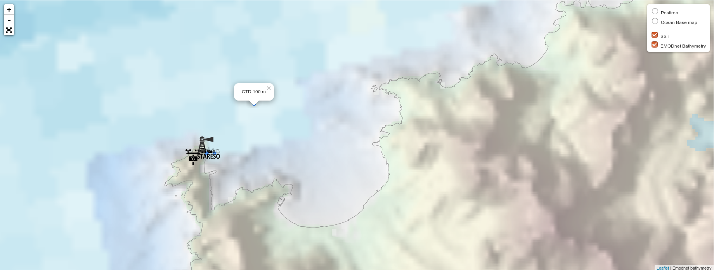

  

# Stareso-Data-Processing

This projects contains mainly Jupyter notebooks in different languages, to demonstrate how to access data from the RACE data base and analyse them.

## Notebooks

A set of jupyter-notebooks providing examples of how to access the data files through the [RACE database](http://www.gitan.ulg.ac.be/cms/index.php?page=donnees-de-stareso#1.), read the data from the files and create some plots and basic analysis.


### Virtual environment

```bash
mkvirtualenv -p python3.10 RaceDB
workon RaceDB
pip install psycopg2
pip install matplotlib
pip install ipykernel
python -m ipykernel install --user --name RaceDB
```

## Leaflet

A simple example of a [leaflet](map) displaying the CTD stations along with other layers such as the [EMODnet Bathymetry](http://www.emodnet-bathymetry.eu/).



## Images

Examples of images generated with the notebooks using real observations.
